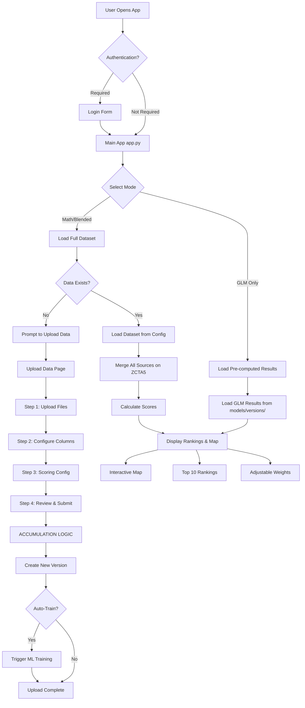

# Pharmacy Desert Explorer - Complete Platform Flow

## 🎯 Overview

The platform identifies "pharmacy deserts" (areas with limited pharmacy access) by:
1. **Ingesting** user-uploaded data files
2. **Merging** multiple data sources on ZIP/ZCTA codes
3. **Scoring** areas using mathematical models + ML models
4. **Visualizing** results on interactive maps
5. **Training** ML models on accumulated data

---

## 📊 Complete Data Flow



---

## 🔄 Detailed Component Flow

### 1. **Application Startup** (`app/app.py`)

```
User → Authentication Check → Mode Selection → Data Loading
```

**Key Functions:**
- `main()` - Entry point
- `render_dynamic_weight_sliders()` - UI for adjusting model weights
- Mode selection: GLM Only vs Math/Blended

**Data Loading Strategy:**
- **GLM Mode**: Fast - loads pre-computed results from `models/versions/`
- **Math/Blended Mode**: Slower - loads full dataset, merges sources, calculates scores

---

### 2. **Data Upload Flow** (`app/pages/Upload_Data.py`)

#### Step-by-Step Process:

**STEP 1: Upload Files**
- User uploads CSV/Excel/JSON/Parquet/ZIP files
- Files stored in `st.session_state.upload_files`
- ZIP files are extracted automatically

**STEP 2: Configure Columns**
- User selects ZIP column
- Chooses normalization mode (5-digit, extract regex, etc.)
- Selects feature columns to keep
- Marks metadata columns (excluded from training)
- Optionally renames columns

**STEP 3: Scoring Configuration**
- User maps columns to scoring components (income, health, etc.)
- Sets component weights
- Configures scoring direction (higher=worse vs higher=better)

**STEP 4: Review & Submit** ← **ACCUMULATION HAPPENS HERE**

```
┌─────────────────────────────────────────────────────────┐
│ STEP 1: Load Existing Sources                          │
│   - Read LATEST.json to get current version            │
│   - Load dataset_config.json                           │
│   - Extract existing_sources[] list                    │
└─────────────────────────────────────────────────────────┘
                    ↓
┌─────────────────────────────────────────────────────────┐
│ STEP 2: Process New Uploads                           │
│   - For each uploaded file:                            │
│     * Generate source_id (stable ID based on filename) │
│     * Check if source_id exists in existing sources    │
│     * Mark as REPLACEMENT or NEW                       │
│   - Build new_sources[] list                           │
└─────────────────────────────────────────────────────────┘
                    ↓
┌─────────────────────────────────────────────────────────┐
│ STEP 3: ACCUMULATE ALL SOURCES                         │
│   - Start with existing_sources[]                      │
│   - Remove sources that are being replaced             │
│   - Add all new/replaced sources                       │
│   - Result: accumulated_sources[] = ALL sources        │
└─────────────────────────────────────────────────────────┘
                    ↓
┌─────────────────────────────────────────────────────────┐
│ STEP 4-8: Create New Version                           │
│   - Upload new/changed files                           │
│   - Copy unchanged files from previous version        │
│   - Merge scoring configs                              │
│   - Create dataset_config.json with ALL sources        │
│   - Update LATEST.json pointer                        │
└─────────────────────────────────────────────────────────┘
```

**Key Files:**
- `storage/datasets.py` - Handles file storage (local or S3)
- `ingestion/dataset_loader.py` - Loads and merges datasets

---

### 3. **Data Loading** (`app/state.py` + `ingestion/dataset_loader.py`)

**When App Needs Data:**

```
app.py → load_smart_dataset_bundle() 
  → Check if ACTIVE_DATASET_ID is set
    → YES: Load from dataset config
    → NO: Load from default files
```

**Loading from Dataset Config:**

```python
load_dataset_from_config(dataset_id, version_id=None)
  ↓
1. Read LATEST.json → get version_id
2. Read dataset_config.json → get sources[]
3. For each source:
   - Load file from storage (local or S3)
   - Apply mapping (normalize ZIP, select features, rename)
   - Return DataFrame
4. Merge all DataFrames on 'zcta5' (outer join)
5. Return merged DataFrame
```

**Storage Backends:**
- **Development**: `raw_data/datasets/{dataset_id}/versions/{version_id}/`
- **Production**: S3 bucket `s3://{bucket}/datasets/{dataset_id}/versions/{version_id}/`

---

### 4. **Scoring System** (`models/scoring.py`)

**Two Scoring Approaches:**

**A. Mathematical Scoring** (Math Mode)
- Weighted sum of normalized components
- User-adjustable weights via sliders
- Components: income, health, education, population, etc.

**B. GLM Scoring** (GLM Mode)
- Pre-computed Poisson GLM model results
- Trained on historical data
- Outputs: IFAE (Index of Pharmacy Access Equity) scores

**C. Blended Mode**
- Combines both mathematical and GLM scores
- Provides robust, research-grade rankings

**Scoring Config:**
- Defined in `models/schema.py`
- Stored in dataset config when uploaded
- Can be customized per dataset

---

### 5. **ML Training Pipeline** (`training/orchestrator.py` + `new_training.py`)

**Triggered After Data Upload:**

```
Upload Complete → trigger_training()
  ↓
1. Export Training Data
   - Load dataset from config
   - Exclude metadata columns
   - Export to CSV
  ↓
2. Run Training Script
   - Execute new_training.py
   - Pass training config via environment variables
  ↓
3. Save Results
   - Save to models/versions/{timestamp}/
   - Update models/LATEST.json
   - Output files:
     * glm_full_coefficients.csv
     * national_ifae_rank.csv
     * metrics.json
```

**Training Script** (`new_training.py`):
- Loads merged training data
- Trains Poisson GLM model
- Calculates residuals
- Generates IFAE rankings
- Saves results to model registry

---

### 6. **Visualization** (`viz/map_viz.py`)

**Map Rendering:**

```
Top 10 Rankings → render_top10_map()
  ↓
1. Add lat/lon coordinates (from dataset or lookup)
2. Merge city/state labels (if available)
3. Create Streamlit map with markers
4. Add tooltips with ZIP info
```

**Display Components:**
- Interactive map (Streamlit `st.map()`)
- Top 10/Bottom 5 rankings table
- Weight adjustment sliders
- Scoring component breakdown

---

## 📁 Key File Structure

```
pharmacy-deserts/
├── app/
│   ├── app.py              # Main UI entry point
│   ├── state.py            # Data loading & caching
│   ├── config.py           # Environment config
│   └── pages/
│       └── Upload_Data.py  # Data upload wizard
│
├── ingestion/
│   ├── parsers.py         # File parsing (CSV, Excel, etc.)
│   ├── normalize.py       # ZIP code normalization
│   └── dataset_loader.py # Load & merge datasets
│
├── storage/
│   └── datasets.py        # Storage backend (local/S3)
│
├── models/
│   ├── schema.py          # Scoring component definitions
│   ├── scoring.py         # Mathematical scoring
│   ├── ai_scores.py       # GLM model integration
│   └── versions/          # Trained model results
│
├── training/
│   └── orchestrator.py    # Training pipeline manager
│
├── data/
│   ├── loaders.py        # Legacy data loaders
│   └── features.py       # Feature preprocessing
│
├── viz/
│   └── map_viz.py        # Map visualization
│
└── raw_data/
    └── datasets/         # Versioned dataset storage
        └── {dataset_id}/
            ├── LATEST.json
            └── versions/
                └── {version_id}/
                    ├── dataset_config.json
                    ├── files/
                    └── mappings/
```

---

## 🔑 Key Concepts

### **Dataset Versioning**
- Each upload creates a new version (timestamp-based ID)
- `LATEST.json` points to current version
- Previous versions preserved for rollback
- Files are copied (not moved) between versions

### **Source Accumulation**
- New uploads ADD to existing dataset (don't replace)
- Sources identified by stable `source_id` (filename-based)
- Re-uploading same filename = replacement
- Uploading new filename = addition

### **Storage Abstraction**
- `DatasetStorageLocal` - Development (filesystem)
- `DatasetStorageS3` - Production (AWS S3)
- Same API, different backends
- Auto-detected from environment config

### **Scoring Configuration**
- Flexible column mapping
- User-defined component weights
- Stored with dataset config
- Can be updated per version

---

## 🚀 Typical User Journey

1. **First Time Setup**
   - User opens app
   - No data exists → prompted to upload
   - Goes to Upload Data page

2. **Upload First Dataset**
   - Uploads population data CSV
   - Configures ZIP column
   - Maps to scoring components
   - Submits → Creates version 1

3. **Add More Data**
   - Uploads health data CSV
   - Configures separately
   - Submits → Creates version 2 (accumulates with version 1)

4. **View Results**
   - Returns to main app
   - Selects Math/Blended mode
   - Sees merged dataset with both sources
   - Adjusts weights, views map

5. **Train Model**
   - After upload, auto-training triggered
   - Model trained on accumulated data
   - Results saved to model registry
   - Can view GLM results in GLM mode

6. **Iterate**
   - Upload more data → new version
   - Replace existing file → new version (replaces that source)
   - All previous data preserved

---

## 🔍 Debugging Tips

**To trace data flow:**
1. Check `raw_data/datasets/pharmacy_data/LATEST.json` - current version
2. Check `raw_data/datasets/pharmacy_data/versions/{version}/dataset_config.json` - sources
3. Check logs for accumulation messages (logger.info)
4. Use `load_dataset_from_config()` directly to test loading

**To trace scoring:**
1. Check `models/schema.py` for component definitions
2. Check dataset config for scoring_config
3. Use `score_with_config()` function directly

**To trace training:**
1. Check `training/orchestrator.py` export_training_data()
2. Check `new_training.py` for model training
3. Check `models/versions/` for results

---

## 📝 Summary

The platform is a **data accumulation and analysis system**:

1. **Upload** → Files stored with versioning
2. **Accumulate** → New data added to existing (not replaced)
3. **Merge** → All sources combined on ZCTA5
4. **Score** → Mathematical + ML models
5. **Visualize** → Interactive maps and rankings
6. **Train** → ML models learn from accumulated data

Everything is **configuration-driven** - users upload arbitrary data formats, map to standard components, and the system handles the rest.
